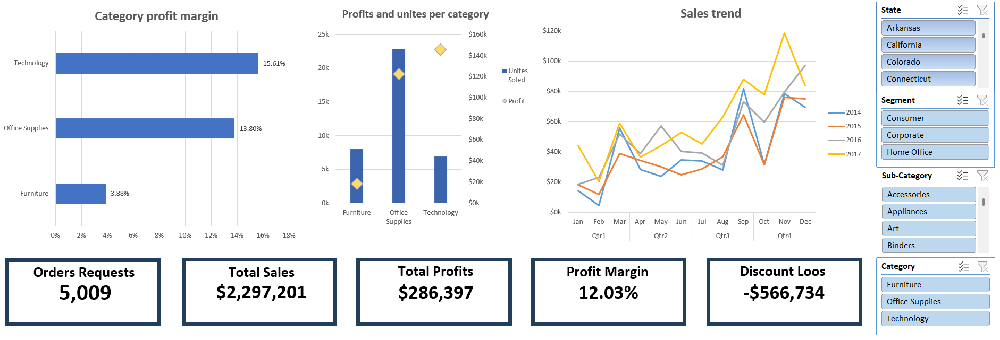
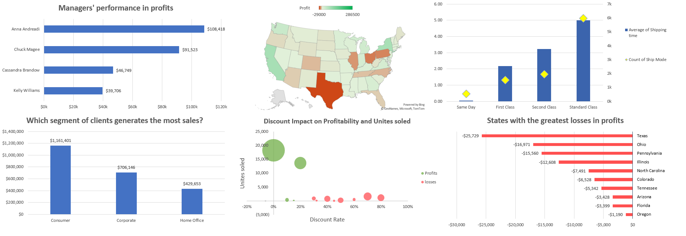

# 📊 Sales Analysis Dashboard

Interactive Excel dashboard for analyzing sales performance, profitability, and operational efficiency using real business data.

### Executive Dashboard

### Operational Insights

---

## 🎯 Project Overview

This project presents a complete end-to-end data analysis workflow in Microsoft Excel — from raw data preparation to building interactive business dashboards.

It demonstrates practical Business Intelligence skills including data cleaning, modeling, analysis, and visualization.

---

## 🧰 Tools & Skills Used

* **Microsoft Excel**
* **Power Query** — Data cleaning & transformation
* **Power Pivot** — Data modeling & relationships
* **Data Model** — Structured analytical layer
* **Pivot Tables** — Aggregation & analysis
* **Slicers** — Interactive filtering
* **Advanced Excel Charts** — Visual storytelling

---

## 🔄 Workflow

1. Raw business dataset preparation
2. Data cleaning & transformation using Power Query
3. Data modeling using Power Pivot & Data Model
4. Analytical calculations with Pivot Tables
5. Building interactive dashboards
6. Visual performance storytelling

---

## 📁 Project Files

* **00_Raw Data - Business Data Set.xlsx** → Original dataset
* **Sales_Analysis_Dashboard.xlsx** → Final interactive dashboard
* **Business Dashboard.png** → Executive dashboard preview
* **Performance Insights.png** → Operational analysis dashboard

---

## 📊 Dashboards Included

### 1️⃣ Executive Business Dashboard

High-level performance overview for decision makers.

**Key Metrics**

* Total Sales
* Total Profit
* Profit Margin
* Orders Count
* Discount Loss
* Sales Trend Over Time
* Category Profitability

---

### 2️⃣ Operational Performance & Insights

Deep-dive analysis to understand performance drivers.

**Key Insights**

* Managers performance in profits
* Sales by customer segment
* Discount impact on profitability and units sold
* Shipping performance by mode
* States generating highest losses

---

## 🔍 Key Business Insights

* Technology category achieves the highest profit margin
* Consumer segment generates the highest sales
* High discount levels strongly correlate with profit losses
* Certain states contribute disproportionately to total losses
* Standard shipping handles the largest operational volume

---

## 👤 Author

**Zaid Shatat**
Data Science & AI Student
